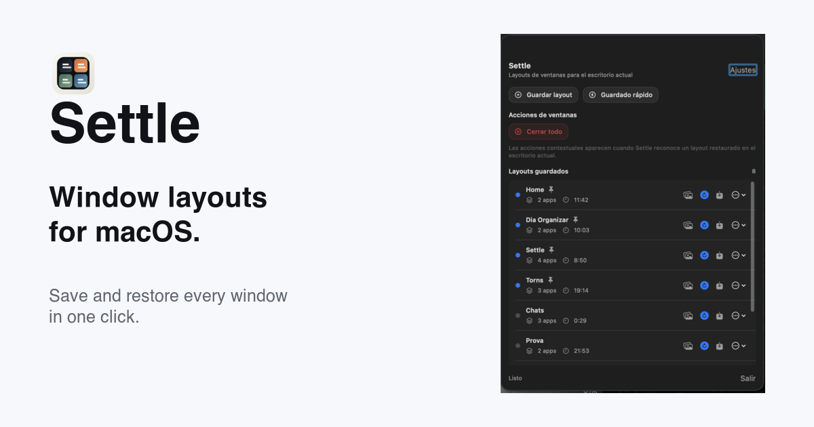

# Settle

**Your Mac windows, right where you left them.**

[](#requirements)
[](Settle)
[](LICENSE)

Switch between work, coding, meeting, and study setups in seconds. Settle reopens your apps and restores every window's size and position while leaving unrelated windows untouched.



## Highlights

- Native macOS app built with `SwiftUI` and `AppKit`
- Save named layouts for the current desktop
- Keep newly saved or updated layouts active immediately in their current Space
- Restore layouts without taking matching app windows away from other Spaces
- Restore front-to-back layering consistently using native macOS application window groups
- Best-effort creation of missing app windows in the current Space through the app's standard Command-N action
- Native Settings for launch behavior, permissions, and future preferences
- Optional launch at login using the macOS login item service
- Optional automatic restore of an explicitly selected default layout at macOS login
- Active layout highlighting that follows the current Space
- Session-scoped indicators for layouts recently detected in other Spaces
- Best-effort navigation to a remembered layout Space by clicking its row
- Unified action bar with primary save, contextual window actions, and a clearly separated destructive quit action
- Dedicated pinned layouts section with manual drag-to-reorder
- Layout snapshot previews inside the saved layouts list
- Contextual actions for restored layouts:
  - quit all apps
  - close non-layout windows
  - minimize non-layout windows
- Localized UI and website in:
  - English
  - Spanish
  - Catalan
  - French
  - German

## Requirements

- macOS `14.0+`
- Accessibility permission enabled for Settle
- Screen Recording permission is optional and used only for layout preview thumbnails
- Apple Silicon is the primary target, with universal macOS builds available in releases

## Install

### Direct download

Download the latest signed DMG from GitHub Releases:

- [Latest release](https://github.com/olerida/Settle/releases/latest)

### Homebrew

```bash
brew install --cask olerida/tap/settle
```

## Accessibility permission

Settle needs macOS Accessibility permission to:

- read visible window titles
- detect app windows
- move and resize windows during restore

Automatic layout restore also requires Accessibility permission. A signed embedded login helper starts Settle at login and requests the restore once; opening Settle manually never restores the default layout. If access is unavailable during login restore, the restore is skipped without changing the selected default layout.

Settle does not use Accessibility to read document contents, passwords, browser page contents, or keystrokes.

Screen Recording access is used only to capture layout preview thumbnails. Settle does not capture system audio.

If you enable Accessibility and the app still shows the warning, quit and reopen Settle.

## Website

- Public site: [http://settle.titanolandia.es](http://settle.titanolandia.es)
- Hosting is built from the `web/` project with Astro

## Build from source

### App

Open [`Settle.xcodeproj`](Settle.xcodeproj) in Xcode and run the `Settle` scheme on `My Mac`.

Command-line debug build:

```bash
xcodebuild -project Settle.xcodeproj -scheme Settle -configuration Debug build
```

### Website

```bash
cd web
npm install
npm run build
```

## Project structure

- `Settle/`: macOS app source
- `SettleTests/`: unit tests
- `web/`: public Astro website
- `CHANGELOG.md`: release notes
- `AGENTS.md`: project-specific agent instructions

## Recent release

Current documented release: `v1.4.0`

See [`CHANGELOG.md`](CHANGELOG.md) for release history.

## Development notes

- The app persists layouts locally as versioned JSON.
- Cross-Space indicators are session-scoped and best-effort because macOS does not expose stable Space identifiers through public APIs.
- Layout restore treats visible windows as authoritative for the current Space; if an app cannot create a missing local window, Settle leaves its other-Space windows untouched and reports the unresolved app by name.
- Releases are published as signed DMG assets on GitHub.
- The Homebrew cask is maintained separately in `~/Documents/homebrew-tap`.
- Backlog work is tracked in GitHub Issues, not in repository TODO files.

## License

Settle is distributed under the terms of the [`MIT License`](LICENSE).
